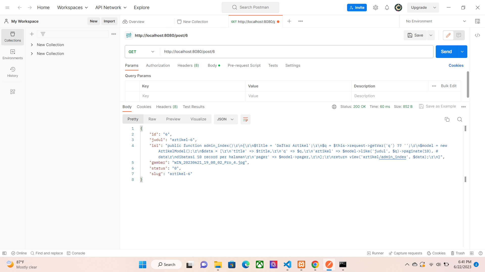
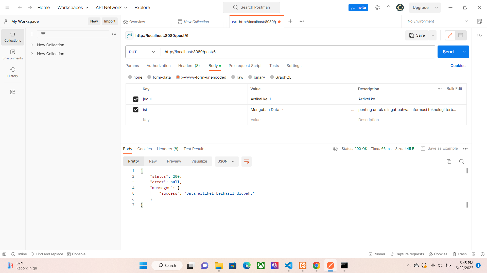
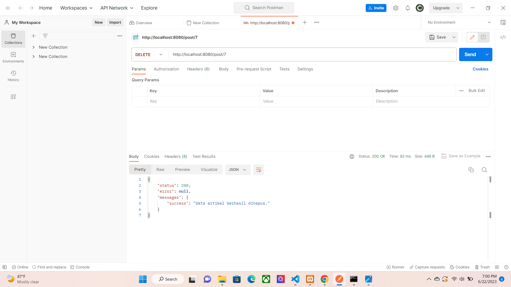
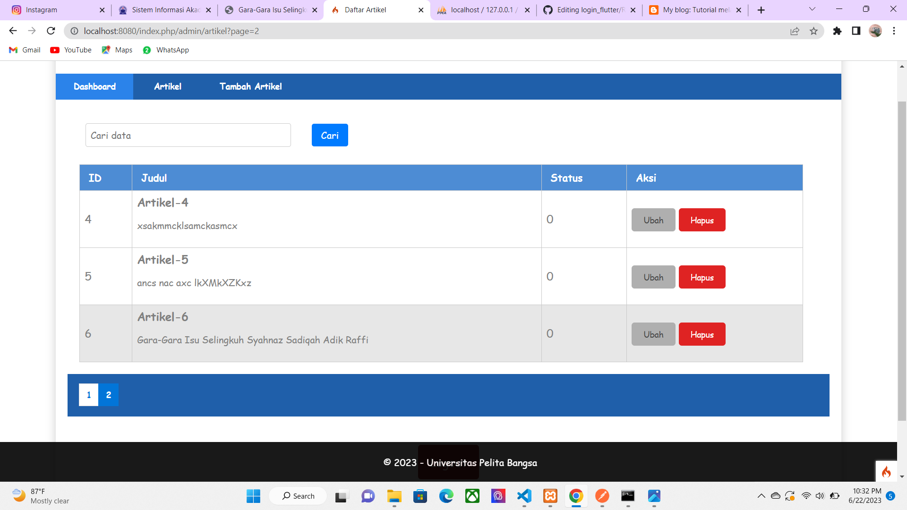

<<<<<<< HEAD
# Lab11web-POSTMAN

---

## Berikut ini adalah pembuatan API menggunakan Framework Codeigniter 4

---

- **Untuk mengecek route nya jalankan perintah berikut:**
``` 
php spark routes
```
---
- **Selanjutnya akan muncul daftar route yang telah dibuat.**


- **Menampilkan Semua data dengan method GET dan Hasil dari test menampilkan semua data artikel dari database**


- **Menampilkan data Spesifik dengan menambahkan ID artikel di belakang URL menggunakan method GET**



- **Mengubah data menggunakan method PUT dengan memasukan URL yang ingin di ubah**



- **Menambahkan data menggunakan method POST untuk menambahkan data baru ke database**


- **Laman ketika berhasil menambahkan artikel baru ke database**


- **Menghapus data menggunakan method DELETE**



- **Laman ketika sebelum terhapus dan sesudah berhasil menghapus menggunakan method delete**
### Before


### After


# TERIMA KASIH
